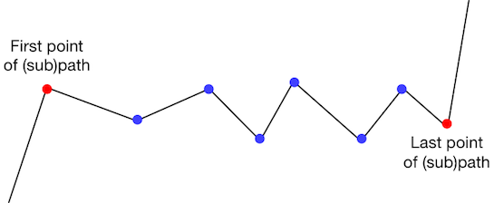
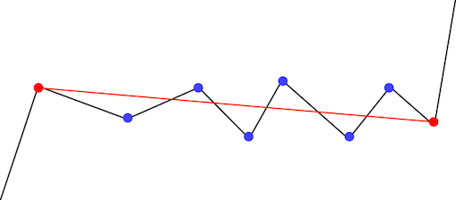
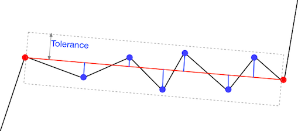
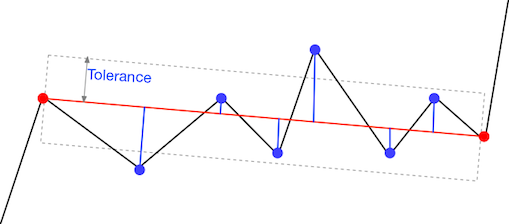
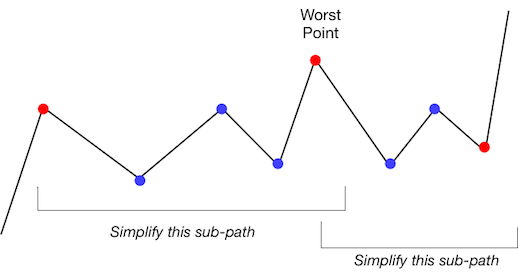

# HOWTO simplify geographic paths

When you zoom out on a map, your map display application (Google 
maps, Apple maps, ESRI ArcGIS, etc) does not draw the rivers, roads, 
and borders in the same level of detail as when you are zoomed far 
in.  How does your application simplify those paths. 

There is a path simplification approach that is almost universal in 
geographic information systems, and also applicable to simplifying 
other complex paths such as hand-written characters. 
It is known as Douglas-Peucker, or sometimes 
[Ramer-Douglas-Peucker](
https://en.wikipedia.org/wiki/Ramer%E2%80%93Douglas%E2%80%93Peucker_algorithm),
after its originators. In robotics, where it is used to extract 
lines from robot range-finder data, it is known as split-and-marge.
We will refer to it simply as _summary_. 

## Recursive summary

Suppose we start with a long list of points from some sampling 
device such as a GPS recorder or a pen moving on a tablet computer. 
We will call that list of points a _path_. 
We want to keep a small number of "important" points and discard the 
rest, forming a new summary path that is very close to the 
original.  The basic idea of the summary algorithm is to 
recursively divide the original path at its most important point.  
A point is considered _important_ if it is far from an imaginary 
line between the start and end of the path under consideration. 

Suppose we want to summarize the subpath between two points in the 
path.

We might first ask, "is a straight line from the first to the last 
point a good enough summary?"    

We will accept this as "good enough" if none of the points between 
is too far from the straight line.  We measure each distance and 
compare to a  pre-determined _tolerance_.  

If all the points are within the tolerance, then we will keep just 
those end-points and discard the points between.  However, we may 
find some points are too far from the straight line.  

In this case, we will identify the point that is _farthest_ from the 
straight line.  We will subdivide at that point. 

When we subdivide at point _p_, we must recursively simplify the 
subpath from the first point to _p_, then from _p_ to the last point.
The summary for the original subpath is the concatenation of the 
summaries for the two small subpaths, representing _p_ just once 
where they join. 

## 