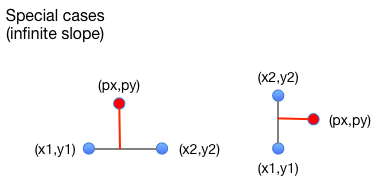

# Dropping a normal

We have a line segment (x1,y1) to (x2,y2). We want to determine the
distance from (px,py) to that segment.

 to (x2, y2) passes through (px, py))

The *shortest* distance from (px,py) to the segment is along
a ray perpendicular to the segment, called a *normal*.
We can calculate that distance using the standard formula
if we find the point where the normal intercepts the segment.

Start by finding the slope of the line segment (x1,y1)
to (x2, y2), which is (y2-y1)/(x2-x1). Call this m1.

The slope of the normal is -1/m1. For example,
if you have a line of slope 1, perpindiculars to that
line will have slope -1, and if you have a line of slope
1/2, perpendiculars to that line will have a slope of -2. We'll call the
slope of the normal m2.

The rest is basic algebra. Recall that the formula for a line on the
cartesian plane can be written as y = mx + b, where m is the
slope and b
is the y-intercept. We have sample x and y values, and we have the
slopes m; we just need the values b to have a pair of simultaneous
equations which can be solved to find their intersection.

We can rewrite y = mx + b as b = y - mx to solve for b. Do this for both
the original segment and the normal segment. We'll call the y-intercept
of the original segment b1, and the y-intercept of the normal segment
b2. Now we have all the coefficients for a line that includes the
original segment and a line that includes the normal ray.

Next we want to find the point (xi, yi) where the normal ray intersects
the segment (or the line passing through the segment). Since we have the
formula for both in slope-intercept form, we can easily solve to find
their intersection by combining them. xi is (b2 - b1)/(m2 - m1), and yi
is m2*xi + b2.

Now that we have (xi,yi) as well as the original (px,py), we can apply
the usual distance formula to find the length of the normal segment.

## Special cases

There are a few special cases we need to be careful of. First, what if
the segment is vertical or horizontal? Then either the slope of the
segment or the slope of its normal is undefined:

Fortunately these cases are very simple to deal with. If the segment (
x1,y1) to (x2,y2) is horizontal (that is, y1 == y2), then the distance
to the intercept with the normal is just |py-y1|. If the segment is
vertical, then the distance to the intercept is just
|px-x1|.

There is one more case we might worry about. We have calculated the
distance of a normal to the *line through* the segment (x1,y1) to (
x2,y2). What if this normal intersects the line outside the segment?

It would not be too hard to recognize this case and use the distance
from (px,py) to one of the endpoints, (x1,y1) or (x2,y2). However, I do
not believe this case will cause a problem in the context of the
Douglas-Peucker line simplification algorithm. We should produce some
test cases to increase our confidence that this is ok. 